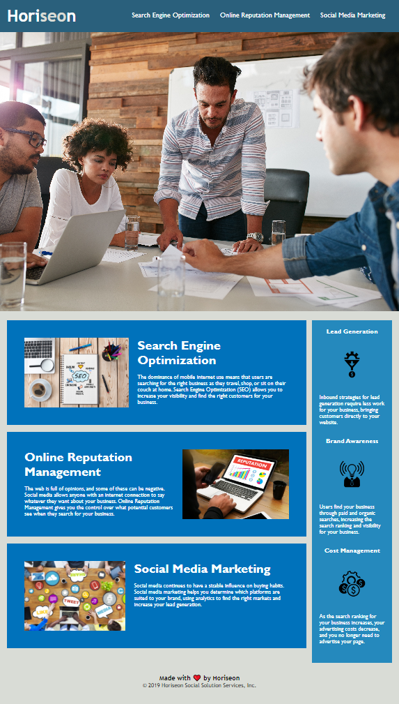

# Module-1-Challenge

## Description 

This is the module 1 Challenge assignment for denver-coding-bootcamp / DU-VIRT-FSF-PT-10-2022-U-LOLC.  

## Installation
Project posted to GitHub - https://github.com/NBADRAUN/Module-1-Challenge
Project deployed to GitHub Pages - https://nbadraun.github.io/Module-1-Challenge

## Usage

In this assignment we were asked to focused on accessibility by refactoring an existing site to make it more accessible.  The following is the user story and acceptance criteria provided.  I have made the nessasary changes.  

## Page Provided

 

## Completed Page

## User Story Provided 

 AS A marketing agency
 I WANT a codebase that follows accessibility standards
 SO THAT our own site is optimized for search engines

## Acceptance Criteria Provided 

 GIVEN a webpage meets accessibility standards
 WHEN I view the source code
 THEN I find semantic HTML elements
 WHEN I view the structure of the HTML elements
 THEN I find that the elements follow a logical structure independent of styling and positioning
 WHEN I view the image elements
 THEN I find accessible alt attributes
 WHEN I view the heading attributes
 THEN they fall in sequential order
 WHEN I view the title element
 THEN I find a concise, descriptive title

## Actions Taken 

 Modified code in HTML and in CSS to resolve the acceptance criteria
 Updated source code in HTML to semantic elements
 Ensured the elements followed a logical structure independant of styling and positioning
 Added alt attributes to image elements
 adjusted heading elements to fall in the correct order
 Added a concise, descriptive title

## Feedback on items missed from first submission
 1. The Search Engine Optimization navigation item doesn't link to the corresponding section on the page. This is because you are missing an ID on line 28 of your HTML
 2. Application's CSS selectors and properties are not consolidated
 3. The application's CSS file contains no comments
 4. The application's HTML file contains no comments
 5. Repo doesn't have a unique name. An example of a unique name would be: horiseon-accessibility-refactor

## Actions taken to correct feedback and resubmit 
 1. Added the id in HTML correcting the link target
 2. Consolidated the CSS selectors and properties where possible 
 3. Added comments to CSS file
 4. Added comments to the HTML file 
 5. Created a new Repo with a more unique name and imported all data from the previous Repo 
 Note:  Thank you very much for the feedback!  I really helped me to go back and make the nessasary changes for the learning experience.  
